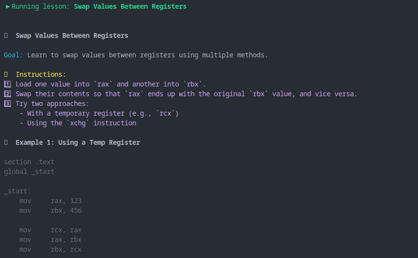

# Assembly Tutor


Welcome to the **Assembly Tutor** project! This project is designed to help you learn assembly language programming through a series of interactive lessons and practice exercises. It covers everything from basic concepts like binary math and registers to advanced topics like anti-debugging techniques and ROP chains.

## Project Structure

The project is organized into various lessons and topics. Each lesson includes an explanation, code samples, and interactive exercises to help solidify your knowledge.

### Folder Structure:

```
assembly-tutor
├── launcher.py            # Main script to launch the tutor
├── lessons                # Folder containing all lessons categorized by topics
│   ├── advanced           # Advanced topics like anti-debugging, optimizations, etc.
│   ├── digital_world      # Topics related to digital systems, networking, and protocols
│   ├── intermediate       # Intermediate level lessons on assembly concepts
│   ├── intro              # Introductory lessons covering basics
│   ├── number_system      # Topics on binary, hexadecimal, and number systems
│   └── practice           # A variety of practice problems for skill development
├── __pycache__            # Cached Python files
└── README.md              # Project documentation
```


### Lessons Overview

#### 1.  **Introductory Lessons** :

* **Arithmetic** : Basic arithmetic operations in assembly.
* **Bitwise Operations** : Bitwise AND, OR, XOR, and shifts.
* **Hello World** : Writing the first assembly program.
* **Debugging** : Learning how to debug assembly code using gdb.

#### 2.  **Intermediate Lessons** :

* **Function Calls** : Understanding function calls, stack frames, and return values.
* **Memory Addressing** : Working with different types of memory and addressing modes.
* **Control Flow** : Implementing loops, conditional branches, and function calls.
* **System Calls** : Interacting with the operating system via system calls.

#### 3.  **Advanced Lessons** :

* **Anti-Debugging** : Techniques used to protect programs from debugging.
* **ROP Chains** : Exploiting Return-Oriented Programming for exploits.
* **Position Independent Code** : Writing code that works at any memory address.

#### 4.  **Digital World Lessons** :

* **Networking** : Understanding networking protocols and packet structures (TCP, IP, Wi-Fi).
* **Compression Formats** : Exploring how different file formats (JPEG, PNG, PDF) are encoded.
* **Malware Signature** : Identifying malware based on byte patterns.
* **DNS Queries** : Analyzing DNS traffic and understanding the DNS protocol.


#### 5.  **Practice Problems** :

* **Array Indexing** : Working with arrays in assembly.
* **Conditional Branching** : Implementing logic using if-else statements.
* **System Calls** : Writing assembly code that makes system calls to interact with the OS.
* **Shellcode Runner** : Running and analyzing shellcode.

## Requirements

To run the project, you'll need Python 3.x installed on your machine. This tutor is designed to work in a Unix-like environment, such as Linux or macOS. On Windows, a WSL (Windows Subsystem for Linux) setup is recommended.

You also need to have a basic understanding of assembly language, but the project includes explanations and examples to help you along the way.

### Dependencies:

* **Python 3.x** : Install from [python.org](https://www.python.org/downloads/)
* **NASM** : For compiling assembly code (install via your package manager).

## Running the Tutor

To start the tutor, simply run the `launcher.py` script:

```bash
python launcher.py
```

This will prompt you to select a lesson and guide you through it. Each lesson will have its own set of instructions and examples, along with quizzes or practice problems for reinforcement.

## Contributing

If you would like to contribute to this project, feel free to fork the repository, create a new branch, and submit a pull request. We welcome contributions in the form of bug fixes, new lessons, or enhancements to the existing content.

## License

This project is licensed under the MIT License. See the LICENSE file for more details.

---
